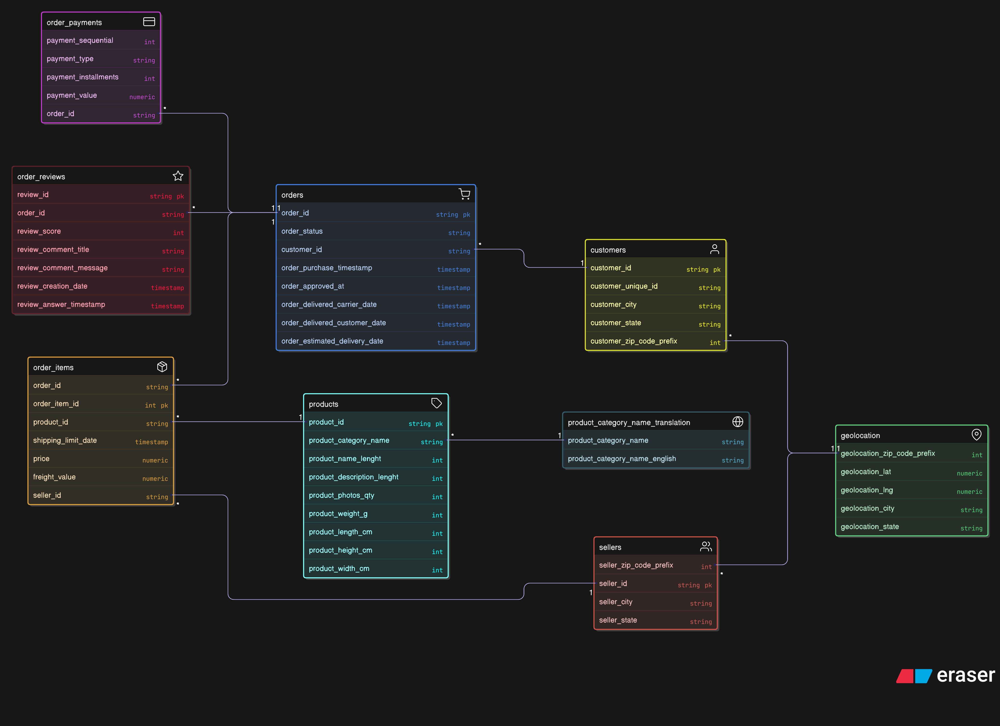

# Avion Express Brasil

Полный стек для аналитики данных интернет‑магазина: **Postgres + API + Apache Superset + Python‑скрипты**.

## Структура
```
.
├─ docker-compose.yml
├─ Dockerfile               # API или Python-скрипт
├─ Dockerfile.superset
├─ main.py                  # пример SQL-запросов (psycopg2)
├─ init/                    # SQL для инициализации схемы olist
├─ data/                    # исходные CSV (только чтение)
└─ src/img/ERD_ecommerce.png
```



## Запуск
```bash
docker compose up -d --build
```
- Postgres доступен на `localhost:5432` (user/pass `postgres`).
- Superset: http://localhost:8088 (admin/superset).
- API (ваш сервис): http://localhost:8000

## Пример SQL-запросов
`main.py` подключается к схеме `olist` и выполняет несколько агрегирующих запросов:
- количество заказов по месяцам,
- среднее время доставки,
- ТОП‑5 городов по числу заказов.

Запуск из контейнера:
```bash
docker build -t olist-runner .
docker run --rm --network host olist-runner
```
Или с хоста: установите `psycopg2-binary` и запустите `python main.py`.

## Superset
Для построения дашбордов:
1. Создайте подключение: `postgresql+psycopg2://postgres:postgres@db:5432/postgres`
2. Укажите схему `olist` и таблицу (например, `orders`).
3. Стройте чарты и дашборды.

## Сброс данных
Полная очистка (удаляет тома Postgres и Superset):
```bash
docker compose down -v
docker compose up -d --build
```
